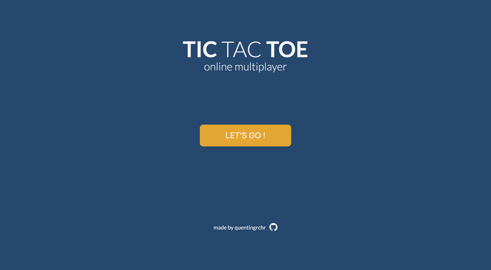
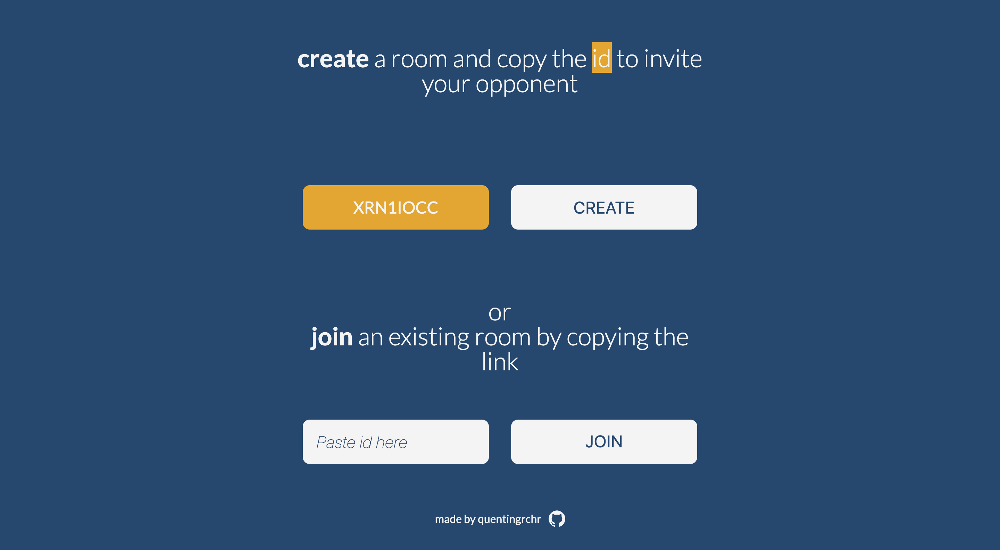

# ✏️ TIC TAC TOE ONLINE

Client side of an online 2 players Tic Tac Toe game, made with **React**, **Node.js** and **Socket.io**.

[](https://tic-tac-toe-online.netlify.app)
[Go to website](https://tic-tac-toe-online.netlify.app)

## ❓ How to play ?

### 🚪 Create a room

To start a private game the first player need to **create** and copy the ID of his room.
The second player will have to paste the same ID in the **join** input.
The creator of the room will always be cross.


### 📏 Rules

Do I really need to explain the rules ?

### 🥊 Rounds

You can play as many rounds as you wish.
When someone wins the round the winner will be displayed on the screen,
to start the next round you just need to click anywhere.

## ❓How to install ?

Clone the repository
In the project directory,
run:

```shell
yarn install
```

to install all the dependencies,
then run:

```shell
yarn start
```

to run the app in the development mode.
Open http://localhost:3000 to view it in the browser.
